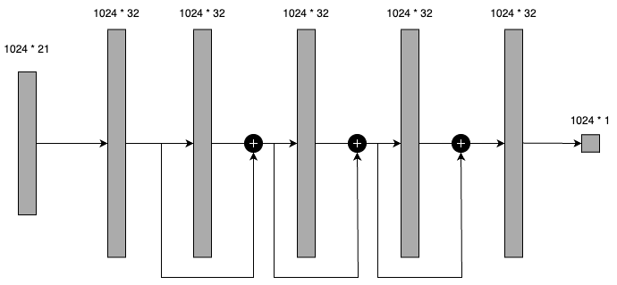
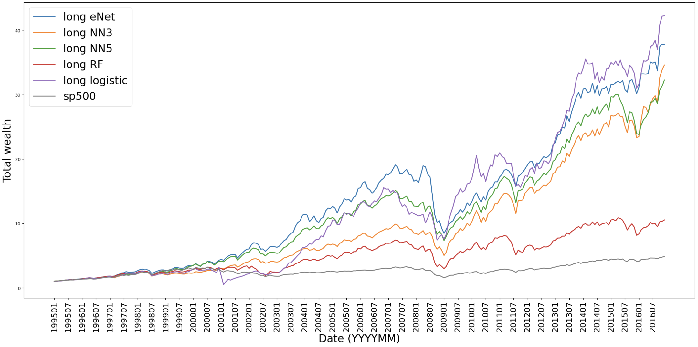
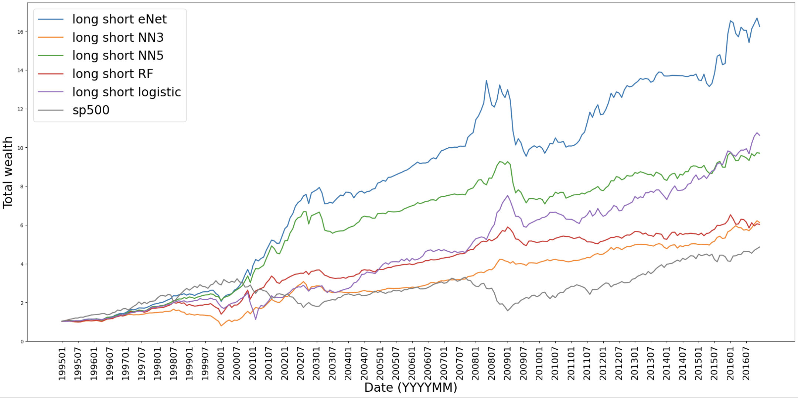

# ML-based US stock return prediction and portfolio allocation

## Authors 

- Tianze (Steven) Shou ([LinkedIn](https://www.linkedin.com/in/tianze-shou-528510247/), [GitHub](https://github.com/Sho-Shoo/))
- Wenhan (Flora) Li ([LinkedIn](https://www.linkedin.com/in/wenhan-li-40495624b/))
- Sizhe (Mia) Zhang ([LinkedIn](https://www.linkedin.com/in/zszmia/), [GitHub](https://github.com/miaszhang)) 
- Yaoyun (Lucy) Hu ([LinkedIn](https://www.linkedin.com/in/lucy-yaoyun-hu-ab9634220/), [GitHub](https://github.com/lucyhuhu)) 

## Write-ups 

[Poster](writeups/poster.pdf), [report](writeups/report.pdf)

## Major methods 

We employed several ML models, including random forest, logistic classifier, elastic net, and neural networks to predict future stock excess return and quantitatively allocate portfolio. Below are the two neural network architectures we developed for the task. 

  
  

## Major results 

We developed ML stock predictors and trading strategies that outruns S&P500 market index significantly: 

  

  

